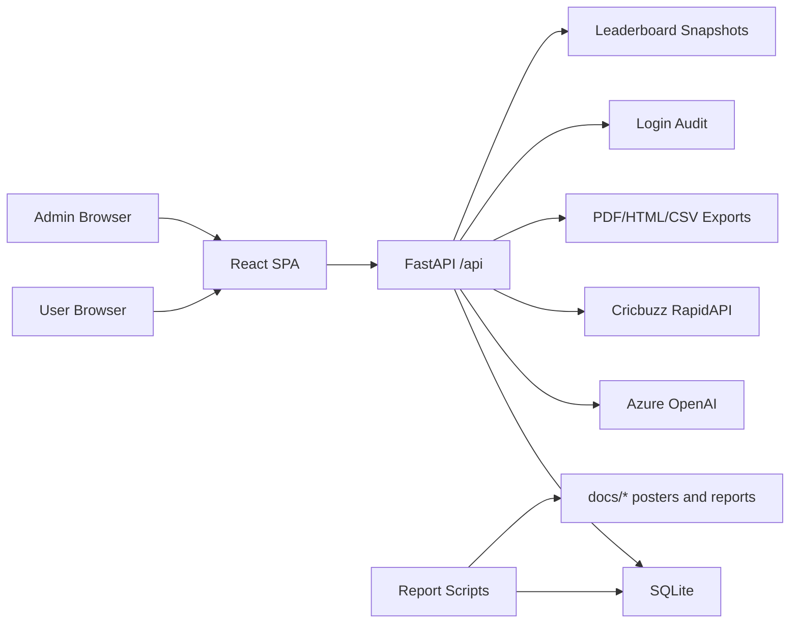

# IFL 2026 Fantasy League

IFL is a full-stack IPL fantasy league app with user predictions, squad scoring, player swaps, leaderboard movement, admin scoring, and generated match reports.

This local copy is configured to use SQLite by default.

## Stack
- Frontend: React + Vite in `client/`
- Backend: FastAPI in `server/app.py`
- ORM: SQLAlchemy models in `server/models.py`
- Primary database in this workspace: SQLite at `server/data/ifl.sqlite3`
- Optional compatibility export/import scripts remain in `server/scripts/`
- Deployment: Docker and Azure App Service assets

## Architecture


## Local Development
```bash
cd /Users/ankitmohapatra/Documents/IFL_Sqllite
npm install
pip3 install -r server/requirements.txt
npm run dev:server
```

In a second terminal:
```bash
npm run dev:client
```

Frontend: `http://localhost:5173`
Backend: `http://localhost:4000`

The backend now defaults to:

- `sqlite:///server/data/ifl.sqlite3`

You only need `DATABASE_URL` if you want to override that default.

Sample local credentials:

- User: `demo`
- User password: `pw`
- Team code: `IFL2026`
- Admin username: `admin`
- Admin password: `ifl@2026`

## Docker
```bash
docker build -t ifl-fullstack:latest .
docker run --rm -p 4000:4000 \
  -e PORT=4000 \
  -e DATABASE_URL='sqlite:////home/site/wwwroot/server/data/ifl.sqlite3' \
  -e ADMIN_USERNAME='admin' \
  -e ADMIN_PASSWORD='<password>' \
  -e ADMIN_TOKEN_SECRET='<secret>' \
  -e AZURE_OPENAI_ENDPOINT='https://<resource>.openai.azure.com/' \
  -e AZURE_OPENAI_API_KEY='<azure-openai-key>' \
  -e AZURE_OPENAI_DEPLOYMENT='gpt-4.1-mini' \
  -e AZURE_OPENAI_API_VERSION='2024-10-21' \
  -e CRICBUZZ_RAPIDAPI_KEY='<rapidapi-key>' \
  -e CRICBUZZ_RAPIDAPI_HOST='cricbuzz-cricket.p.rapidapi.com' \
  ifl-fullstack:latest
```

## Runtime Environment
- `PORT`: default `4000`
- `DATABASE_URL`: optional override; defaults to local SQLite
- `ADMIN_USERNAME`: admin login username
- `ADMIN_PASSWORD`: admin login password
- `ADMIN_TOKEN_SECRET`: required in production
- `AZURE_OPENAI_ENDPOINT`: Azure OpenAI resource endpoint for AI scoring
- `AZURE_OPENAI_API_KEY`: Azure OpenAI key
- `AZURE_OPENAI_DEPLOYMENT`: Azure OpenAI deployment name used for scoring drafts
- `AZURE_OPENAI_API_VERSION`: Azure OpenAI API version
- `CRICBUZZ_RAPIDAPI_KEY`: required for Cricbuzz scorecard fetch during AI scoring
- `CRICBUZZ_RAPIDAPI_HOST`: defaults to `cricbuzz-cricket.p.rapidapi.com`
- `ADMIN_TOKEN_TTL_SEC`: default `900`
- `ADMIN_MAX_ATTEMPTS`: default `5`
- `ADMIN_ATTEMPT_WINDOW_SEC`: default `900`
- `BUILD_VERSION`: optional UI build label

## User Features
- Phone/password login and registration with admin-managed allowlist.
- Guest Demo mode for visitors to experience the app with dummy read-only data without joining the league.
- Predictions with match-level isolated upsert by `user_id` and `match_id`.
- Prediction lock before match start.
- Winner options include both teams and `NR`; `NR` gives 0 prediction points and is ignored for prediction accuracy.
- Playoffs Prediction stored in `store_kv`.
- Prediction ratio cards on Home for all locked same-day fixtures.
- Players At Play screen with poster-style team splits for that day's matches.
- My Team with current effective squad, flip cards, player archetype avatars, match-wise points, and swapped-out frozen point summary.
- Super Swapper with 1 to 3 player swaps per active window.
- Frozen Squads showing latest effective squads.
- Logged-in Home with current leader spotlight, rotating leader pedestal, auto-scrolling leaderboard preview, rank movement, and quick navigation.
- Leaderboard with rank movement, gap insights, “What Can Change Today”, and PDF export.
- Profile with team logo upload and summary.

## Admin Features
- Dashboard and access management.
- Players and matches maintenance.
- Scoring import through JSON/CSV/manual entry.
- AI scoring draft flow backed by static Cricbuzz match-id mapping, Cricbuzz RapidAPI scorecards, Azure OpenAI draft generation, and fixture-player name reconciliation before preview.
- Winner and no-result handling.
- User management.
- User Points screen showing match-wise player and prediction contribution.
- Swap Validation screen with approve/reject and PDF export.
- Playoffs prediction view and export.
- Login device audit by user.
- Leaderboard PDF export with rank, team, last earned, total points, last prediction, and prediction points.
- Admin UI uses the same navy/gold glass visual system as user screens.

## Guest Experience
Guest Demo is a read-only simulation for visitors:
- Launched from the public home page through `Guest Demo`.
- Does not create users, predictions, swaps, or database writes.
- Shows simulated Home, Predictions, Today's Edge, My Team, Super Swapper, Playoff Predictions, Rules, and Profile.
- Guest Home includes a demo leader highlighter and demo leaderboard with rank up/down movement.
- Guest My Team includes 11 player cards, archetype avatar badges, dummy popularity stars, accumulated points on flip, swapped frozen points, and previous match points.

## Scoring Rules
| Component | Points |
|---|---:|
| Run | 1 |
| Catch | 5 |
| Runout/Stumping | 10 |
| Wicket | 20 |
| 3 wickets bonus | 25 |
| 4 wickets bonus | 50 |
| 5 wickets bonus | 100 |
| 50 runs bonus | 25 |
| 75 runs bonus | 50 |
| 100 runs bonus | 100 |
| Man of the Match | 50 |
| Correct winner prediction | 50 |

## AI Scoring Flow
Admin scoring now supports an assisted draft path before import:

1. Select the fixture in `Admin > Points Scoring`.
2. Backend resolves the Cricbuzz `matchId` from `server/data/cricbuzz_match_ids_2026.json` using fixture teams and match date.
3. Backend fetches the raw scorecard JSON from Cricbuzz RapidAPI.
4. Azure OpenAI converts that structured scorecard into the app import schema.
5. Backend tries to reconcile draft player names against the IFL fixture player pool before preview.
6. Admin reviews the generated JSON, then runs `Preview`, `Apply Import`, and `Save & Recalculate`.

The draft endpoint exposed to the admin UI is:
- `POST /api/admin/scoring/draft-json`

## Player Swap Model
Swaps are intentionally stored separately from the original squad:
- `user_players` remains the original selected squad history.
- `swap_windows` defines active windows and the `effective_match_id`.
- `user_swaps` stores submitted/frozen/validated swap pairs.
- Scoring, My Team, Frozen Squads, leaderboard last-earned, and players-at-play use effective squad logic.
- Effective squad for a match is: original squad, then every frozen/validated swap whose window `effective_match_id <= match_id`.
- Swapped-out players stop scoring from the effective match onward.
- Swapped-in players start scoring from the effective match onward.

## Database Tables
- `users`
- `players`
- `matches`
- `user_players`
- `user_swaps`
- `swap_windows`
- `predictions`
- `match_player_stats`
- `match_meta`
- `activity_feed`
- `user_login_audit`
- `store_kv`
- `leaderboard_snapshots`

## Store Keys
The compatibility store accepts:
- `ifl_users`
- `ifl_master_players`
- `ifl_master_matches`
- `ifl_match_stats`
- `ifl_swap_windows`
- `ifl_playoffs_predictions`
- `ifl_allowed_phones`
- `ifl_global_team_code`

## API Surface
- `GET /api/health`
- `GET /api/bootstrap`
- `GET /api/admin/session`
- `POST /api/admin/login`
- `GET /api/store/{key}`
- `PUT /api/store/{key}`
- `POST /api/user/prediction`
- `POST /api/user/login-audit`
- `POST /api/user/swaps`
- `POST /api/user/swaps/list`
- `POST /api/user/swaps/reset`
- `POST /api/user/swaps/freeze`
- `GET /api/admin/swaps`
- `POST /api/admin/swaps/validate`
- `POST /api/admin/swaps/reject`
- `POST /api/admin/users/points`
- `GET /api/admin/login-audit`
- `POST /api/admin/scoring/draft-json`
- `GET /api/admin/exports/playoffs-predictions`
- `GET /api/admin/exports/leaderboard/daily`
- `GET /api/leaderboard/prev-ranks`
- `GET /api/activity-feed`
- `POST /api/activity-feed`

## Report Generation
Prediction ratio:
```bash
python docs/generate_prediction_ratio_poster.py YYYY-MM-DD
```

Players at play:
```bash
python docs/generate_players_at_play_poster.py YYYY-MM-DD
```

Other generated reports include playoff prediction extracts, swap insights, and unique swap calls under `docs/`.

Scoring debug and conversion helpers:
```bash
python server/scripts/test_cricbuzz_rapidapi.py --match-id 151924 --insecure
python server/scripts/test_cricbuzz_match_lookup.py --date 'Sun, 26 Apr 2026' --team1 KKR --team2 LSG --pretty
python server/scripts/convert_cricbuzz_scorecard_to_import.py --match-id 151924 --motm 'Rinku Singh' --pretty
python server/scripts/debug_ai_scoring_draft.py --match-id 38 --print-sources
```

## Data Migration
SQLite snapshot export:
```bash
python server/scripts/export_sqlite_snapshot.py \
  --sqlite-path /Users/ankitmohapatra/Desktop/IFL/server/data/ifl.sqlite3 \
  --truncate-first
```

SQLite snapshot import:
```bash
python server/scripts/import_sqlite_snapshot.py \
  --sqlite-path /Users/ankitmohapatra/Desktop/IFL/server/data/ifl.sqlite3 \
  --truncate-first
```

Both snapshot utilities should preserve current swap, prediction, snapshot, and login audit tables.

## Azure
See `deploy/azure/README.md` for App Service commands and Apple Silicon build notes.

The deployed App Service name may differ from local examples. Confirm with:
```bash
az webapp list -g <resource-group> -o table
```

## Operational Notes
- Admin writes require a valid backend token.
- Prediction edits should use `/api/user/prediction`; do not refresh the full `ifl_users` payload for a single prediction.
- Scoring recalculation updates prediction correctness and awarded prediction points per match/user.
- AI scoring depends on both Azure OpenAI credentials and `CRICBUZZ_RAPIDAPI_KEY`.
- Admin Docker and shell env values should use plain ASCII quotes; curly quotes can break password comparison.
- Leaderboard rank movement depends on snapshots in `leaderboard_snapshots`.
- Login audit is written on successful login and records device/browser/OS signals.
- Guest Demo is intentionally local/read-only and should not call write APIs.
