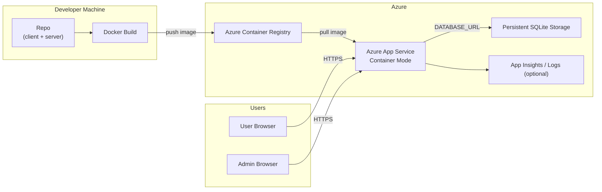

# Azure Deployment

This project is containerized and deployable to Azure as a single image.

Important:
- FastAPI + SQLite deployment on Azure App Service must run as **Web App for Containers**.
- Built-in Node/Oryx runtime is not supported for this backend runtime path.
- Keep the app on a single instance when using SQLite.
- Store the SQLite file on persistent storage, not inside the image filesystem.

## Deployment diagram (Azure)


## Build and test image locally

```bash
docker build -t ifl-fullstack:latest .
docker run --rm -p 4000:4000 \
  -e PORT=4000 \
  -e DATABASE_URL='sqlite:////app/data/ifl.sqlite3' \
  -e ADMIN_USERNAME='admin' \
  -e ADMIN_PASSWORD='<strong-admin-password>' \
  -e ADMIN_TOKEN_SECRET='<long-random-secret>' \
  -v "$(pwd)/server/data:/app/data" \
  ifl-fullstack:latest
```

## Deploy to Azure Container Registry + Container Apps

Before creating the app, attach an Azure Files share to the Container Apps environment:

```bash
RG=<resource-group>
LOCATION=<azure-region>
STG=<storage-account-name>
SHARE=<azure-file-share-name>
ENV=<container-app-env>

az storage account create -n $STG -g $RG -l $LOCATION --sku Standard_LRS
az storage share-rm create --resource-group $RG --storage-account $STG --name $SHARE
STG_KEY=$(az storage account keys list -n $STG -g $RG --query "[0].value" -o tsv)

az containerapp env storage set \
  -g $RG \
  -n $ENV \
  --storage-name sqlitefiles \
  --azure-file-account-name $STG \
  --azure-file-account-key $STG_KEY \
  --azure-file-share-name $SHARE \
  --access-mode ReadWrite
```

```bash
# Variables
RG=<resource-group>
LOCATION=<azure-region>
ACR=<acr-name>
IMAGE=ifl-fullstack
TAG=latest
ENV=<container-app-env>
APP=<container-app-name>

az group create -n $RG -l $LOCATION
az acr create -n $ACR -g $RG --sku Basic
az acr login -n $ACR

# Build and push image
az acr build --registry $ACR --image $IMAGE:$TAG .

# Create managed environment
az containerapp env create -n $ENV -g $RG -l $LOCATION

# Deploy app
az containerapp create \
  -n $APP \
  -g $RG \
  --environment $ENV \
  --image $ACR.azurecr.io/$IMAGE:$TAG \
  --target-port 4000 \
  --ingress external \
  --registry-server $ACR.azurecr.io \
  --cpu 0.5 \
  --memory 1Gi \
  --env-vars \
    PORT=4000 \
    DATABASE_URL='sqlite:////app/data/ifl.sqlite3' \
    ADMIN_USERNAME=admin \
    ADMIN_PASSWORD='<strong-admin-password>' \
    ADMIN_TOKEN_SECRET='<long-random-secret>'
```

The companion sample manifest at [containerapp.yaml](/Users/ankitmohapatra/Documents/IFL_Sqllite/deploy/azure/containerapp.yaml) already includes the persistent volume mount:
- mount path: `/app/data`
- database file: `/app/data/ifl.sqlite3`
- environment storage placeholder: `<environment-storage-name>`

## Deploy to Azure App Service (Web App for Containers)

```bash
RG=<resource-group>
PLAN=<app-service-plan-name>
APP=<webapp-name>
ACR=<acr-name>
IMAGE=ifl-fullstack
TAG=latest

az appservice plan create -g $RG -n $PLAN --is-linux --sku B1
az webapp create -g $RG -p $PLAN -n $APP \
  -i $ACR.azurecr.io/$IMAGE:$TAG

az webapp config appsettings set -g $RG -n $APP --settings \
  WEBSITES_PORT=4000 \
  WEBSITES_ENABLE_APP_SERVICE_STORAGE=true \
  PORT=4000 \
  DATABASE_URL='sqlite:////home/data/ifl.sqlite3' \
  ADMIN_USERNAME=admin \
  ADMIN_PASSWORD='<strong-admin-password>' \
  ADMIN_TOKEN_SECRET='<long-random-secret>'
```

The companion sample settings file at [webapp-settings.txt](/Users/ankitmohapatra/Documents/IFL_Sqllite/deploy/azure/webapp-settings.txt) uses:
- `WEBSITES_ENABLE_APP_SERVICE_STORAGE=true`
- `DATABASE_URL=sqlite:////home/data/ifl.sqlite3`

## Working command sequence (Apple Silicon -> App Service)
Use this sequence when building on Mac and deploying `linux/amd64` image:

```bash
# Variables
RG=<resource-group>
APP=<webapp-name>
ACR=<acr-name>
IMAGE=ifl-fullstack
TAG=latest

# (Optional) tail current app logs
az webapp log tail -g $RG -n $APP

# Resolve ACR endpoint and login
LOGIN_SERVER=$(az acr show -n $ACR -g $RG --query loginServer -o tsv)
az acr login -n $ACR

# Build and push amd64 image (important for App Service runtime compatibility)
docker buildx build --platform linux/amd64 -t $LOGIN_SERVER/$IMAGE:$TAG --push .

# Enable ACR admin user (quick setup)
az acr update -n $ACR --admin-enabled true
ACR_USER=$(az acr credential show -n $ACR --query username -o tsv)
ACR_PASS=$(az acr credential show -n $ACR --query "passwords[0].value" -o tsv)

# Bind image to existing Web App
az webapp config container set \
  -g $RG \
  -n $APP \
  --container-image-name $LOGIN_SERVER/$IMAGE:$TAG \
  --container-registry-url https://$LOGIN_SERVER \
  --container-registry-user $ACR_USER \
  --container-registry-password $ACR_PASS

# Set app settings
az webapp config appsettings set -g $RG -n $APP --settings \
  WEBSITES_PORT=4000 \
  WEBSITES_ENABLE_APP_SERVICE_STORAGE=true \
  PORT=4000 \
  DATABASE_URL='sqlite:////home/data/ifl.sqlite3' \
  ADMIN_USERNAME=admin \
  ADMIN_PASSWORD='<strong-admin-password>' \
  ADMIN_TOKEN_SECRET='<long-random-secret>'

# Restart and verify logs
az webapp restart -g $RG -n $APP
az webapp log tail -g $RG -n $APP
```

## Notes

- Configure `DATABASE_URL`, `ADMIN_USERNAME`, `ADMIN_PASSWORD`, and `ADMIN_TOKEN_SECRET` in Azure app settings.
- For App Service, keep the SQLite file under `/home`, not under `/app` or `/tmp`.
- For Container Apps, use an Azure Files mount and point `DATABASE_URL` at that mounted path.
- Use plain ASCII quotes in shell commands. Curly quotes around secrets can cause runtime login failures.
- Image startup installs Python dependencies from `server/requirements.txt` (including `SQLAlchemy`), so keep that file in sync with backend imports.
