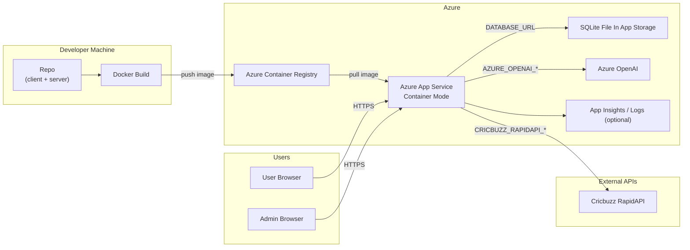

# Azure Deployment

This project is containerized and deployable to Azure as a single image.

Important:
- FastAPI + SQLite deployment on Azure App Service must run as **Web App for Containers**.
- Built-in Node/Oryx runtime is not supported for this backend runtime path.

## Deployment diagram (Azure)


## Build and test image locally

```bash
docker build -t ifl-fullstack:latest .
docker run --rm -p 4000:4000 \
  -e PORT=4000 \
  -e DATABASE_URL='sqlite:////home/site/wwwroot/server/data/ifl.sqlite3' \
  -e ADMIN_USERNAME='admin' \
  -e ADMIN_PASSWORD='<strong-admin-password>' \
  -e ADMIN_TOKEN_SECRET='<long-random-secret>' \
  -e AZURE_OPENAI_ENDPOINT='https://<resource>.openai.azure.com/' \
  -e AZURE_OPENAI_API_KEY='<azure-openai-key>' \
  -e AZURE_OPENAI_DEPLOYMENT='gpt-4.1-mini' \
  -e AZURE_OPENAI_API_VERSION='2024-10-21' \
  -e CRICBUZZ_RAPIDAPI_KEY='<rapidapi-key>' \
  -e CRICBUZZ_RAPIDAPI_HOST='cricbuzz-cricket.p.rapidapi.com' \
  ifl-fullstack:latest
```

## Deploy to Azure Container Registry + Container Apps

```bash
# Variables
RG=<resource-group>
LOCATION=eastus
ACR=<acr-name>
IMAGE=ifl-fullstack
TAG=latest
ENV=<container-app-env>
APP=ifl-fantasy-app

az group create -n $RG -l $LOCATION
az acr create -n $ACR -g $RG --sku Basic
az acr login -n $ACR

# Build and push image
az acr build --registry $ACR --image $IMAGE:$TAG .

# Create managed environment
az containerapp env create -n $ENV -g $RG -l $LOCATION

# Deploy app
az containerapp create \
  -n $APP \
  -g $RG \
  --environment $ENV \
  --image $ACR.azurecr.io/$IMAGE:$TAG \
  --target-port 4000 \
  --ingress external \
  --registry-server $ACR.azurecr.io \
  --cpu 0.5 \
  --memory 1Gi \
  --env-vars \
    PORT=4000 \
    DATABASE_URL='sqlite:////app/server/data/ifl.sqlite3' \
    ADMIN_USERNAME=admin \
    ADMIN_PASSWORD='<strong-admin-password>' \
    ADMIN_TOKEN_SECRET='<long-random-secret>' \
    AZURE_OPENAI_ENDPOINT='https://<resource>.openai.azure.com/' \
    AZURE_OPENAI_API_KEY='<azure-openai-key>' \
    AZURE_OPENAI_DEPLOYMENT='gpt-4.1-mini' \
    AZURE_OPENAI_API_VERSION='2024-10-21' \
    CRICBUZZ_RAPIDAPI_KEY='<rapidapi-key>' \
    CRICBUZZ_RAPIDAPI_HOST='cricbuzz-cricket.p.rapidapi.com'
```

## Deploy to Azure App Service (Web App for Containers)

```bash
RG=appsvc_linux_centralindia_basic  
PLAN=appsvc_linux_centralindia_basic  
APP=ifl-beta
ACR=iflbeta  
IMAGE=ifl-fullstack
TAG=latest

az appservice plan create -g $RG -n $PLAN --is-linux --sku B1
az webapp create -g $RG -p $PLAN -n $APP \
  -i $ACR.azurecr.io/$IMAGE:$TAG

az webapp config appsettings set -g $RG -n $APP --settings \
  WEBSITES_PORT=4000 \
  PORT=4000 \
  DATABASE_URL='sqlite:////home/site/wwwroot/server/data/ifl.sqlite3' \
  ADMIN_USERNAME=admin \
  ADMIN_PASSWORD='<strong-admin-password>' \
  ADMIN_TOKEN_SECRET='<long-random-secret>' \
  AZURE_OPENAI_ENDPOINT='https://<resource>.openai.azure.com/' \
  AZURE_OPENAI_API_KEY='<azure-openai-key>' \
  AZURE_OPENAI_DEPLOYMENT='gpt-4.1-mini' \
  AZURE_OPENAI_API_VERSION='2024-10-21' \
  CRICBUZZ_RAPIDAPI_KEY='<rapidapi-key>' \
  CRICBUZZ_RAPIDAPI_HOST='cricbuzz-cricket.p.rapidapi.com'
```

## Working command sequence (Apple Silicon -> App Service)
Use this sequence when building on Mac and deploying `linux/amd64` image:

```bash
# Variables
RG=<resource-group>
APP=<webapp-name>
ACR=<acr-name>
IMAGE=ifl-fullstack
TAG=latest

# (Optional) tail current app logs
az webapp log tail -g $RG -n $APP

# Resolve ACR endpoint and login
LOGIN_SERVER=$(az acr show -n $ACR -g $RG --query loginServer -o tsv)
az acr login -n $ACR

# Build and push amd64 image (important for App Service runtime compatibility)
docker buildx build --platform linux/amd64 -t $LOGIN_SERVER/$IMAGE:$TAG --push .

# Enable ACR admin user (quick setup)
az acr update -n $ACR --admin-enabled true
ACR_USER=$(az acr credential show -n $ACR --query username -o tsv)
ACR_PASS=$(az acr credential show -n $ACR --query "passwords[0].value" -o tsv)

# Bind image to existing Web App
az webapp config container set \
  -g $RG \
  -n $APP \
  --container-image-name $LOGIN_SERVER/$IMAGE:$TAG \
  --container-registry-url https://$LOGIN_SERVER \
  --container-registry-user $ACR_USER \
  --container-registry-password $ACR_PASS

# Set app settings
az webapp config appsettings set -g $RG -n $APP --settings \
  WEBSITES_PORT=4000 \
  PORT=4000 \
  DATABASE_URL='sqlite:////home/site/wwwroot/server/data/ifl.sqlite3' \
  ADMIN_USERNAME=admin \
  ADMIN_PASSWORD='<strong-admin-password>' \
  ADMIN_TOKEN_SECRET='<long-random-secret>' \
  AZURE_OPENAI_ENDPOINT='https://<resource>.openai.azure.com/' \
  AZURE_OPENAI_API_KEY='<azure-openai-key>' \
  AZURE_OPENAI_DEPLOYMENT='gpt-4.1-mini' \
  AZURE_OPENAI_API_VERSION='2024-10-21' \
  CRICBUZZ_RAPIDAPI_KEY='<rapidapi-key>' \
  CRICBUZZ_RAPIDAPI_HOST='cricbuzz-cricket.p.rapidapi.com'

# Restart and verify logs
az webapp restart -g $RG -n $APP
az webapp log tail -g $RG -n $APP
```

## Notes

- Configure `DATABASE_URL`, `ADMIN_USERNAME`, `ADMIN_PASSWORD`, `ADMIN_TOKEN_SECRET`, `AZURE_OPENAI_*`, and `CRICBUZZ_RAPIDAPI_*` in Azure app settings.
- Admin AI scoring now resolves a Cricbuzz match id from the static 2026 map, fetches the scorecard JSON from RapidAPI, and then generates the import draft through Azure OpenAI.
- Use plain ASCII quotes in shell commands. Curly quotes around secrets can cause runtime login failures.
- Image startup installs Python dependencies from `server/requirements.txt` (including `SQLAlchemy`), so keep that file in sync with backend imports.
- For persistent production use, mount durable storage for the SQLite file path instead of relying on ephemeral container filesystem state.
